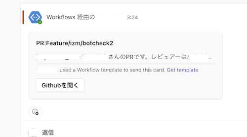

# GitHub to Teams PR Alerts 🚀

Welcome to the **GitHub to Teams PR Alerts** Action! This GitHub Action is designed to notify your Microsoft Teams channel whenever a Pull Request is reviewed or requested on GitHub, making collaboration smoother and more efficient.
[日本語版のREADMEはこちら](README_ja.md)

## Features 🌟

- **Review Request Notifications:** Sends a notification to Teams when a Pull Request is requested.
- **Review Submission Notifications:** Alerts your team when a review is submitted, especially if changes are requested.
- **Customizable:** Easily map your GitHub usernames to Microsoft Teams emails within the workflow for personalized notifications.

## Prerequisites 📋

Before you set up this action, ensure you have the following:
- A Microsoft Teams channel with a configured incoming webhook.
- The webhook URL added to your GitHub repository secrets.

## Setup Instructions 🛠

1. **Add the Webhook URL to Your Secrets:**
   - Go to your repository's settings.
   - Navigate to `Secrets` and then to `Actions`.
   - Click on `New repository secret`.
   - Name your secret `TEAMS_WEBHOOK_URL` and paste your Microsoft Teams webhook URL.

2. **Define User Mappings:**
   - In the [workflow file](.github/workflows/github-to-teams-pr-alerts.yml), adjust the `USER_EMAIL_MAPPING_JSON` to include mappings from GitHub usernames to Teams emails.
   - Example format: `"github_username": "email@example.com"`

3. **Enable/Disable Notifications:**
   - Use the `SEND_TO_TEAMS` environment variable to control notification sending (set to `false` to disable).

## Workflow Breakdown 📖

- **Check TEAMS_WEBHOOK_URL:** Ensures that the webhook URL is specified.
- **Define User Mappings:** Maps GitHub usernames to Teams emails.
- **Notification Triggers:**
  - When a review is requested.
  - When a review is submitted with changes requested.

## Adding the Workflow to Your Repository 📁

1. Create a `.github/workflows/` directory in your repository if it doesn't exist.
2. Add the `github-to-teams-pr-alerts.yml` file to this directory.
3. Customize the user mappings and webhook URL as described above.

## Contributing 🤝

Contributions are what make the open source community such an amazing place to learn, inspire, and create. Any contributions you make are **greatly appreciated**.

1. Fork the Project
2. Create your Feature Branch (`git checkout -b feature/AmazingFeature`)
3. Commit your Changes (`git commit -m 'Add some AmazingFeature'`)
4. Push to the Branch (`git push origin feature/AmazingFeature`)
5. Open a Pull Request

## License 📄

Distributed under the MIT License. See `LICENSE` for more information.

## Need Help? 🤔

If you run into issues or have any questions, please feel free to raise an issue in the repository or submit a pull request with improvements!

Happy coding! 🎉
