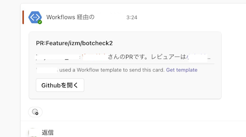

# GitHub to Teams PR Alerts 🚀

GitHubのプルリクエストがレビューされたりリクエストされた際にMicrosoft Teamsのチャンネルへ通知するためのGitHub Action、「GitHub to Teams PR Alerts」です！

このGithub Actionsは、コラボレーションをスムーズかつ効率的に行うために設計されています。

## 特徴 🌟

- **レビューリクエスト通知：** プルリクエストがリクエストされたときにTeamsに通知します。
- **レビュー提出通知：** レビューが提出されたとき、特に変更が要求された場合にチームにアラートを送ります。
- **ユーザのメールアドレスをカスタマイズ可能：** ワークフローファイル内でGitHubユーザー名をMicrosoft Teamsのメールアドレスに簡単にマッピングして、個人化された通知を行えます。

## 前提条件 📋

このアクションを設定する前に、以下のものが必要です：
- 設定済みのIncomingWebhookを持つMicrosoft Teamsのチャンネル。
- GitHubリポジトリのシークレットにWebhook URLが追加されていること。

## 設定手順 🛠

1. **Webhook URLをシークレットに追加：**
   - リポジトリの設定にアクセスします。
   - `Secrets`、そして `Actions` に進みます。
   - `New repository secret` をクリックします。
   - シークレットの名前を `TEAMS_WEBHOOK_URL` に設定し、Microsoft TeamsのIncomingWebhook URLを貼り付けます。

2. **ユーザーマッピングの定義：**
   - [ワークフローファイル](.github/workflows/github-to-teams-pr-alerts.yml)内で `USER_EMAIL_MAPPING_JSON` を調整し、GitHubユーザー名からTeamsアカウントのメールアドレスへのマッピングを含めます。
   - 形式例：`"github_username": "email@example.com"`

3. **通知の有効/無効化：**
   - `SEND_TO_TEAMS` 環境変数を使用して通知の送信を制御します（無効にするには `false` に設定）。

## ワークフローの概要 📖

- **TEAMS_WEBHOOK_URLの確認：** Webhook URLが指定されていることを保証します。
- **ユーザーマッピングの定義：** GitHubユーザー名をTeamsのメールにマッピングします。
- **通知のトリガー：**
  - レビューがリクエストされたとき。
  - 変更が要求されたレビューが提出されたとき。

## リポジトリへのワークフローの追加 📁

1. リポジトリに `.github/workflows/` ディレクトリがない場合は作成します。
2. このディレクトリに `github-to-teams-pr-alerts.yml` ファイルを追加します。
3. 上記の説明に従ってユーザーマッピングとWebhook URLをカスタマイズします。

## 貢献 🤝

オープンソースコミュニティは学び、触発し、創造する素晴らしい場所です。あなたが行うすべての貢献は非常に重要です。

1. プロジェクトをフォークします。
2. フィーチャーブランチを作成します（`git checkout -b feature/AmazingFeature`）。
3. 変更をコミットします（`git commit -m 'Add some AmazingFeature'`）。
4. ブランチをプッシュします（`git push origin feature/AmazingFeature`）。
5. プルリクエストを開きます。

## ライセンス 📄

このプロジェクトはMITライセンスの下で配布されています。詳細は`LICENSE`ファイルを参照してください。

## ヘルプが必要ですか？ 🤔

何か問題が発生した場合や質問がある場合は、リポジトリでissueを提起するか、改善のためのプルリクエストを送信してください。
